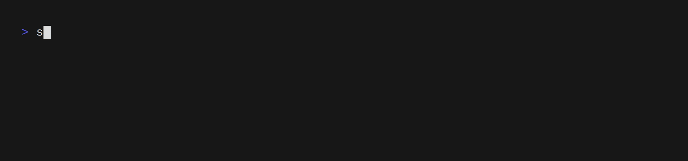
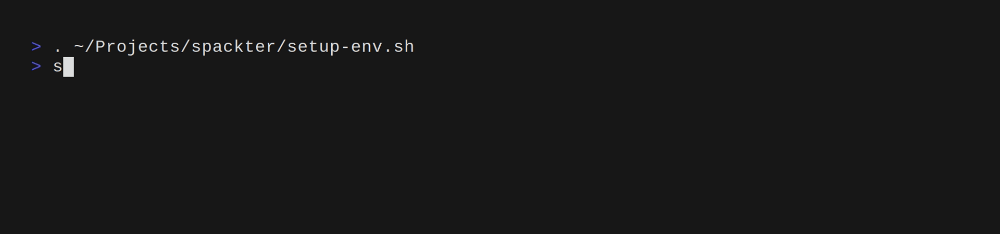

# spackter
Spackter is a tool for the creation and management of multiple spack stacks on the same system.
Creation of new spack stacks can be configured in depth via multiple configuration files.
Examples can be found at `<SPACKTER_ROOT>/configs`.

## Usage (in its current state)
Source spackter's `setup-env.sh` script. This puts the `spackter` command in your path and sets required environment variables.
When spackter is first executed it installs a python virtual environment with all python dependencies. 
Spackter only requires a semi recent version of `python3` to be installed on the system. 
### Creating new spack stacks

Spack stacks can be created with the `spackter create` command (see `spackter create --help` for full options).

`spackter create` expects a name for the spack stack as the argument.
The following options are available:
 * `--configs=<value>`: where `value` must be the name of one of the directories in the `<SPACKTER_ROOT>/configs/`. By default the `default` configuration is used.
 * `--prefix=value`: where `value` is a path to a directory where the spack stack shall be installed. By default all spack stacks get installed to the `<SPACKTER_ROOT>/spack/` directory.
 * `--compiler=<value>`: where `value` is a compiler spec in spack syntax (e.g.: `gcc@13.2.0`). This compiler will be built as a first step in the spack stack creation and will be used to compile all packages.
    If this option is omitted spack will use the system compiler for building packages. 
 * `--allow-errors=<value>`: where `value` is a comma separated string of `['all', 'patch', 'pr', 'package', 'script']`. If a step in one of the listed phases fails spackter will automatically skip it and proceed with building the spack stack.
 * `--no-allow-errors=<value>`: where `value` is a comma separated string of `['all', 'patch', 'pr', 'package', 'script']`. If a step in one of the listed phases fails spackter will abort. If a phase is not mentioned in this or `--allow-errors`
    the user will be promted on how to proceed if an error occurs.
#### Spackter configs
Multiple phases of the creation of a spack stack are configured via the files contained in the given config directory.
The config directories can contain the following files:
 * **spack configuration files**: If spack configuration files are placed in the config dir they will be copied over to the `etc/spack/` directory of the created spack stack and used by spack.
   Spackter sets `SPACK_DISABLE_LOCAL_CONFIG=1` so that spack's **site** configuration files are always used. If a configuration file is not present or left empty the deault spack configuration settings will be used.
 * **patches**: if the `<config-dir>/patches` directory contains any `*.patch` files spackter will try to apply them during spack stack creation.
 * **Pull Requests**: The `pull-requests.spackter` file may contain a list of pull request from the official spack github repository that spackter will try to apply during stack creation. The syntax is one PR number per line.
 * **packages**: The `package-list.spackter` file may contain a list of packages that shall be installed for this spack stack. The syntax is one package per line.
 * **post install script**: The `post-install-script.spackter` may contain shell commands that shall be executed at the end of spack stack creation. The script will be executed with the spack stacks root directory as current working directory.
 * **pre- and post-script**: The `pre-script.spackter` and `post-script.spackter` files will be used to create a `env.sh` script that will be used to load the spack created spack stack. The pre-script part will be sourced before the `setup-env-sh`
    of the spack stack is sourced and the post-script afterwards. They can for example be used to set environment variables and to automatically load modules each time the spack stack is loaded.
   
For examples of all of these configurations setttings see the `configs/test` directory.
### Listing installed spack stacks

The `spackter list` command gives a list of all installed spack stacks and some of their most important configuration options.
The given `ID` for each spack stack can be used with the `--id` option of the following commands if there are multiple spack stacks with the same name but at different prefixes.
### Loading a spack stack

The `spackter load` command is used to load a spack stack.

`spackter load` expects a name/id as the argument.
The following options are available:
 * `--id`: If this option is set the first argument to `spackter load` will be interpreted as an id instead of a name.
 * `--only-env-script`: Restricts the output of the command to only the path to the spack stack's `env.sh` script. This can be used for easier loading of the stack via command line tools. (e.g.: `. $(spackter load demo)`.
   
By default `spackter load` is currently not able to load the spack stack automatically and the user has to source the returned `env.sh` script themself.
As a workaround for this a `spackter-load` bash function exists which can be called instead from the user's shell (e.g. `spackter-load demo`) and will load the spack stack for the current shell process.
### Deleting spack stacks
The `spackter delete` command will remove a spack stack. 

`spackter delete` expects a name/id as the argument.
The following options are available:
 * `--id`: If this option is set the first argument to `spackter delete` will be interpreted as an id instead of a name.
 * `--only-spackter-entry`: If this option is set the spack stack will only be removed from the spackter database and not be deleted from disk.
